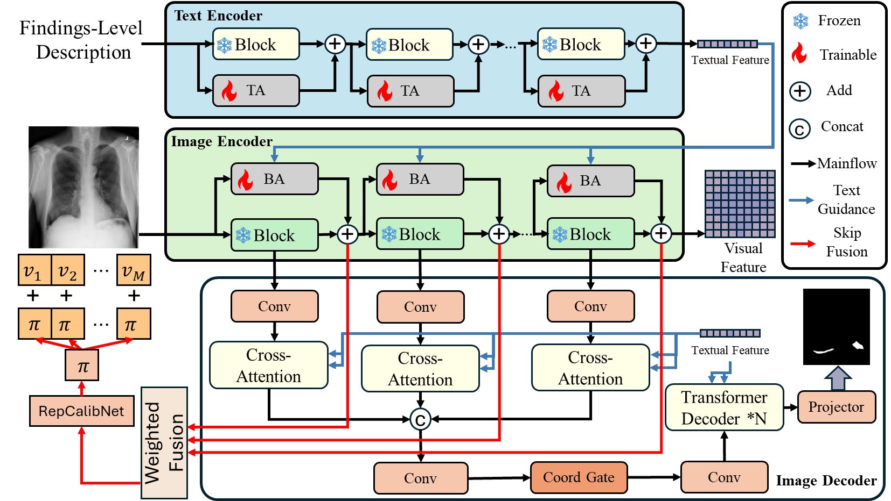

# Report-Guided Segmentation

**Grounding Radiology Report Findings into Medical Image Segmentation**

A report-findings–guided framework that leverages **full-length clinical radiology reports** to enable fine-grained and clinically consistent **medical image segmentation**, while keeping training **parameter-efficient** via lightweight adapters.

---

## 🔥 Highlights

- 📄 **Long-report–aware segmentation**: grounds *full clinical radiology reports* (not short prompts) into pixel-level lesion delineation.
- 🧠 **Parameter-efficient design**: large pretrained encoders are frozen; only lightweight adapters and the decoder are trained.
- 🩺 **Clinically aligned masks**: emphasizes anatomically consistent boundaries and radiology-consistent spatial support.
- 🔁 **Multi-scale cross-modal fusion**: aligns report findings with hierarchical visual representations for robust segmentation.

---

## 🧠 Method Overview

Below is the overall architecture of **Report-Guided Segmentation**.

---

## 📦 Repository Status

This repository will host the **official implementation** of *Grounding Radiology Report Findings into Medical Image Segmentation*.

**Planned releases (in progress):**
- Training and evaluation code (**to be released**)
- Inference scripts (**to be released**)
- Pretrained checkpoints (**to be released**)
- Reproducible configs + documentation (**to be released**)

We are currently cleaning up the codebase and preparing documentation to ensure reproducibility.

---

## 🗂️ Data

This study does **not** introduce a new publicly released dataset. Experiments are conducted using a combination of **publicly available datasets** and **clinical imaging data** obtained under institutional approvals.

Due to patient privacy considerations and data use agreements associated with the clinical data sources, patient-level clinical imaging data cannot be publicly shared. Public datasets used in this work can be accessed from their original sources as cited in the paper.

---

## 🚀 Getting Started (Coming Soon)

We will provide:
- environment setup instructions
- dataset preparation scripts
- training / evaluation commands
- inference demo

---

## 📅 Roadmap

- [ ] Release training & evaluation code
- [ ] Release inference scripts
- [ ] Provide pretrained checkpoints
- [ ] Add reproducible configs
- [ ] Add examples / demos

---

